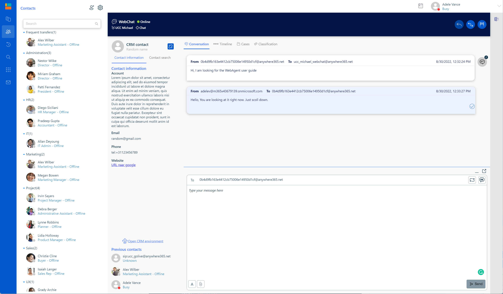

# Debug - Markdown test page

## Heading 1

### Header 2

#### Header 3

This is a paragraph

* This is an unordered list
  * This is the indent

1. This is an ordered list
   1. This is the indent
      1. Another one
         1. Another one

* [ ] This is a task

***


This is an info box



This is an info box with 2 lines

This is line 2



This is a warning box



This is a danger box



This is a success box


> Here is a quote&#x20;

```
// Some code as plain text
```

```html
// Some code as html
```

<figure><figcaption></figcaption></figure>

| Column 1 | Column 2 |
| -------- | -------- |
| Row 1    | Value    |
| Row 2    | Value    |

Left align

<p align="center">Center</p>

<p align="right">Right align</p>

<table data-view="cards"><thead><tr><th></th><th></th><th data-type="checkbox"></th><th data-type="rating" data-max="5"></th><th data-type="users" data-multiple></th></tr></thead><tbody><tr><td>Card 1</td><td>With text</td><td>false</td><td>null</td><td></td></tr><tr><td>Card 2</td><td></td><td>true</td><td>4</td><td></td></tr></tbody></table>

<details>

<summary>Header of an expandable</summary>

Text of the expandable

</details>



Text of first tab



Text of second tab





### Step 1

Step 1 content



### Step 2

Step 2 content





First column



Second column






[getting-started](webagent/getting-started/)


Here is a link in the text [getting-started](webagent/getting-started/ "mention") to another page

Here is a link in the text [#heading-1](debug-markdown-test-page.md#heading-1 "mention") to the same page

Test <a href="debug-markdown-test-page.md#heading-1" class="button primary">New button</a>

Test <code class="expression"></code>This is an expression?

Test <i class="fa-jedi-order">:jedi-order:</i> icon

Test $$f(x) = x * e^{2 pi i \xi x}$$ math

Test  inline image
