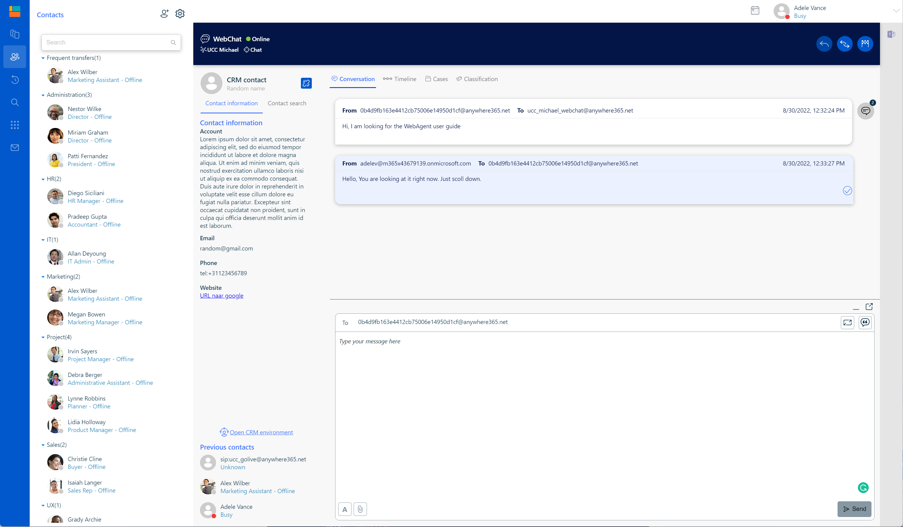

# Introduction

Welcome to **AnywhereNow NEO WebAgent**—your browser‑based command center for customer engagement. Whether you handle incoming calls, reply to chats, or administrate a global contact center, this documentation shows you exactly what to do, when to do it, and why.

<figure><figcaption></figcaption></figure>

### What Is AnywhereNow NEO WebAgent?

AnywhereNow NEO WebAgent is a unified desktop that brings voice and digital interactions together in a single, lightweight tab. You can:

* Receive and place voice calls with full call controls.
* Chat, email, and message customers across multiple digital channels.
* See real‑time customer context from your CRM or collaboration tool.
* Work anywhere—no desktop install, VPN, or softphone required.

### How This Documentation Is Organized

| Guide                   | Purpose                                                                                                 | Typical Reader                                       |
| ----------------------- | ------------------------------------------------------------------------------------------------------- | ---------------------------------------------------- |
| **User Guide**          | Day‑to‑day tasks—signing in, taking calls, sending chats, using shortcuts, and solving common problems. | Contact‑center agents, supervisors, power users      |
| **Administrator Guide** | Planning, deployment, configuration, and ongoing maintenance.                                           | System administrators, IT teams, solution architects |


**Need the big picture?**\
Start with **Getting Started → Navigate the Interface** to learn the layout before diving into channels or integrations.


### Key Concepts

#### Omnichannel Inbox

Handle voice and digital interactions side‑by‑side without juggling multiple windows. Routing decisions are handled upstream, so you focus on the customer.

#### Presence & Capacity

Your presence status (Available, Away, Busy) plus channel capacity rules determine which interactions land on your desktop. Adjust status at any time from the top toolbar.

#### Plugins & Integrations

WebAgent embeds into Microsoft Teams, Dynamics 365, Salesforce, SAP C4C, ServiceNow, Bullhorn, and other workspaces. Each integration adds context panels and screen pops relevant to that platform.

#### Security by Design

Sessions are secured with OAuth/OIDC, all media streams are encrypted, and no customer data is stored locally. See **Administrator Guide → Security & Compliance** for details.

### Next Steps

1. **Agents**: Jump to **Getting Started** to sign in and explore call controls.
2. **Admins**: Review **Planning & Requirements** to confirm prerequisites, then follow an installation path that matches your environment.

Happy engaging!
